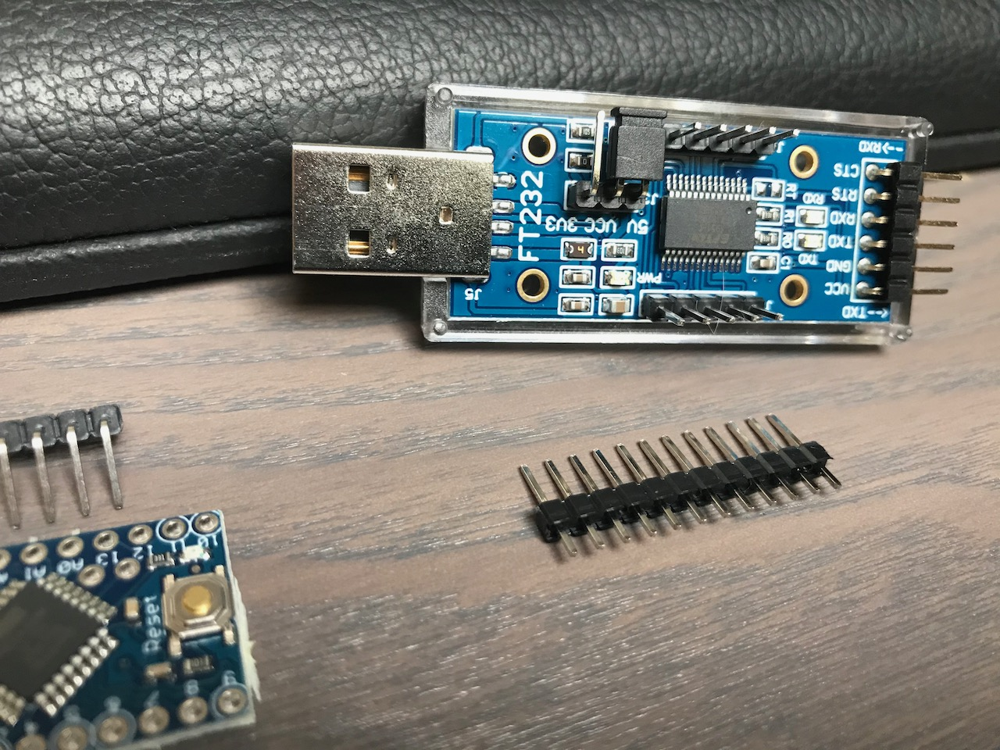
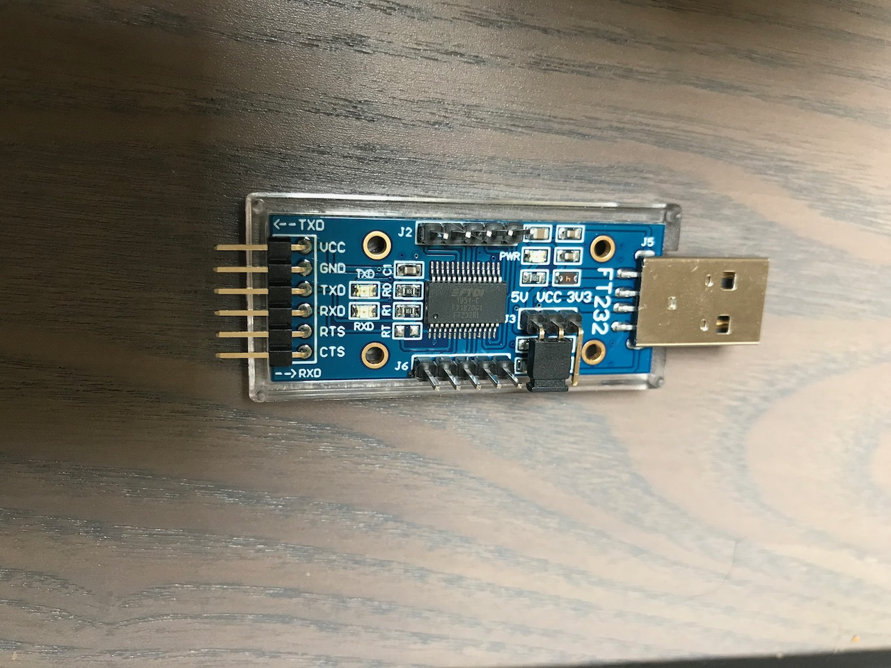
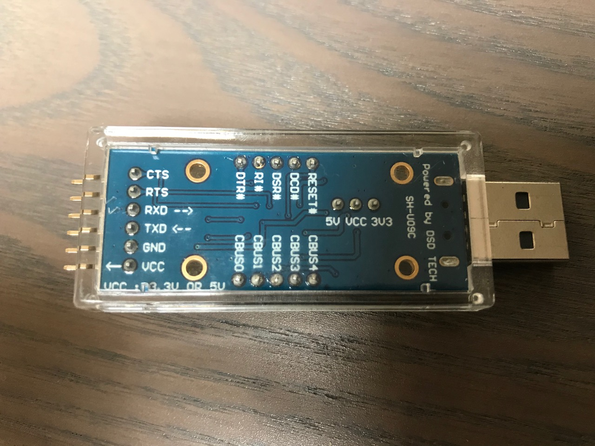

# Adding additional pin headers to Arduino USB adapter

The DST Tech USB to Serial adapter per default has 10 pins which do not have a header or connector.
To be able to easily connect to that pins I've used some pin headers included by the ATmega328P.
In most cases not all pin headers are needed for the ATmega328P.

You can open the case with a slot screwdriver.
The bottom case part is well mounted but not fixed. I tried to push softly at the USB part and suddenly both parts flew away :grinning:

 
 
 
 
 
 
