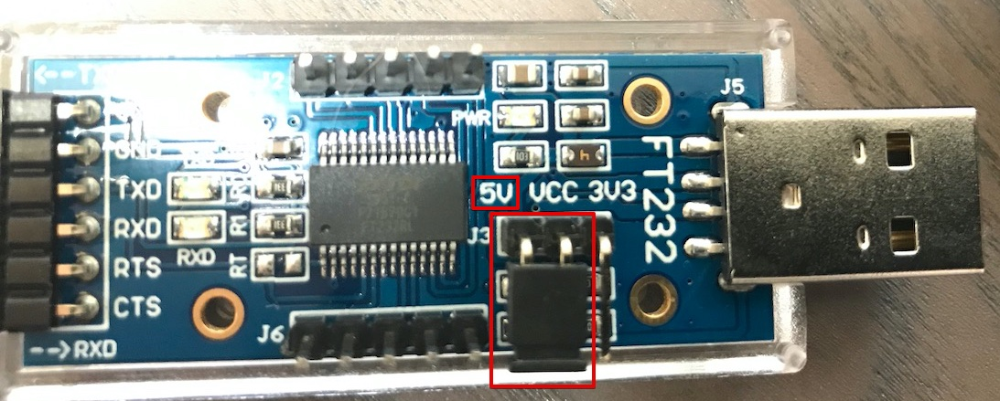
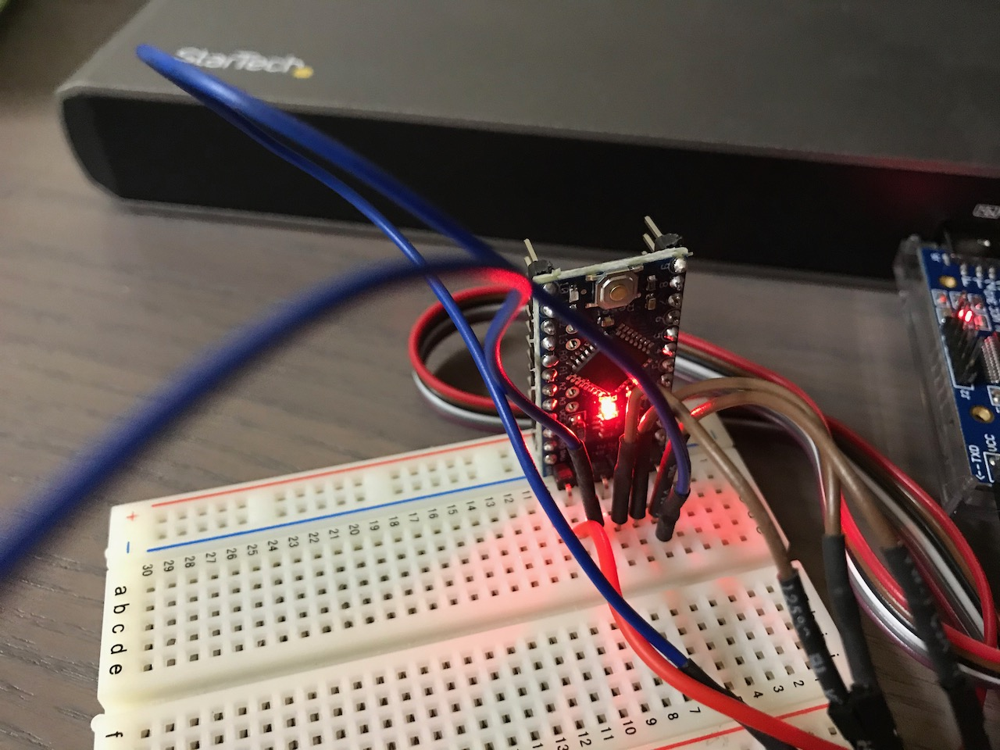
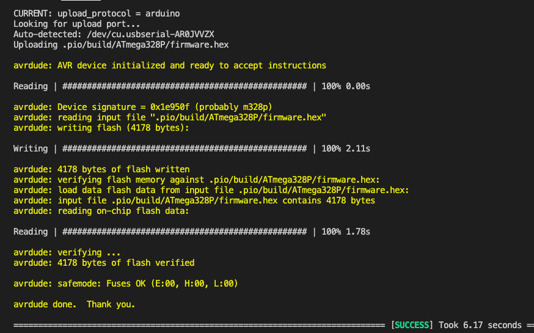

# Flashing Arduino

## Check voltage regulator
Check if the voltage is correct (5V):

## Connect to board
For flashing/uploading sketches to the ATMega328P I've used a breadboard and connected the pins with jump wires. (to easily swap arduino baords without rewiring)

This document helped to identify the pins: [Arduino Pro Mini Datasheet](https://cdn.sparkfun.com/assets/d/5/2/f/0/ProMini16MHzv2.pdf)

| Adapter | Arduino  |
|---|---|
| VCC | VCC |
| GND | GND |
| TXD | RXI |
| RXD | TXO |
| RTS | not connected |
| CTS | GND |
| DTR | DTR (GRN - see datasheet) |

## Flash process

1. Import or open the folder "arduino" of this repository via PIO Home (Platform IO Extension vor VSCode).
1. Plug in the USB adapter
1. In the PlatformIO section in "Project tasks" select "Upload"

During flash process the red LED of the arduino should blink.
The console should output something like this:

If there is an error "avrdude: stk500_recv(): programmer is not responding" check wiring - especially the DTR cable.
