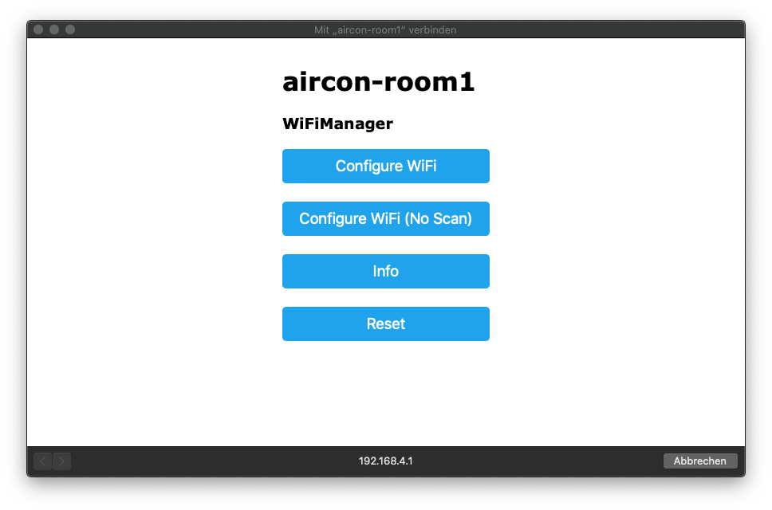

# Flashing and configuring WiFi shield

With the ESP-01 adapter you can flash the ESP8266 WiFi shield.

The adapter has a toggle to switch between "PROG" and "UART". 
Be sure to switch to "PROG" to be able to upload sketches.
If you want to read serial output switch to "UART".
This can be useful for debugging.

## Flash process

1. Import or open the folder "wifi" of this repository via PIO Home (Platform IO Extension vor VSCode).
1. Open ``src/main.cpp``
1. Change ``configSSID`` to something unique you can identify later (this has nothing to do with your existing WiFi)
1. Plug in the USB adapter
1. In the PlatformIO section in "Project tasks" select "Upload"

The console should output something like this:

As soon as the soft reset is done, a new WiFi with the name configured in ``configSSID`` should pop up.

## Setup and start MQTT broker
A MQTT broker is required to receive MQTT messages. 

For more details refer to the [MQTT Homepage](https://mqtt.org/) 

For testing purposes you can use e.g. [Mosquitto](https://mosquitto.org/). 
I've used [hmq (Free and High Performance MQTT Broker)](https://github.com/fhmq/hmq)

Usually starting a test broker is no rocket science. In case of hmq you can just run the executable without parameters to start a broker at port 1883.

## Configuration

1. Optionally start MQTT broker to receive a MQTT debug message at the end of the configuration
1. Connect to the WiFi configured in ``configSSID``
1. A captive portal dialog should open automatically (If not open http://192.168.4.1 in browser)
1. Select **Configure Wifi**
1. On top the found WiFis are listed - select the one which should be used for MQTT
1. Change MQTT IP, Port, Username and Password according to your MQTT broker
1. Change the room name and thing name as you wish
1. Optionally change MQTT topic names
1. Save

Now you can verify setup by watching topics of the MQTT broker.
As soon the board booted a debugging message should be displayed.  

I've used [MQTT Explorer](https://mqtt-explorer.com/) to verify my setup:

## Resetting Configuration

In the case you messed up configuration or just want to reconfigure settings you can:
1. Enable line containing ``wifiManager.resetSettings()``
1. Upload
1. Check for configured ``configSSID`` in WiFi list of your computer or mobile device
1. As soon as the WiFi appears, commented out ``wifiManager.resetSettings()`` and re-upload to make future changes to config persistent again
1. Reconnect to ``configSSID`` and enter your new settings

